# Introdução

Informações básicas do projeto.

* **Projeto:** Desliga AI
* **Repositório GitHub:** https://github.com/ICEI-PUC-Minas-PMGES-TI/pmg-es-2025-2-ti1-2401100-desligaai.git
* **Membros da equipe:**

  * [Evelyn Costa](https://github.com/Evycostzocn) 
  * [Arthur Mendes](https://github.com/arthurlmendes) 
  * [Gabriel Henrique Fernandes](https://github.com/GabrielHFV)
  * [Pedro Henrique](https://github.com/ProezaDEV)
  * [João Pedro Alvarenga](https://github.com/joaopedro003)
  * [Eduardo Pêgo](https://github.com/Eduardo-Pegoz) 

A documentação do projeto é estruturada da seguinte forma:

1. Introdução
2. Contexto
3. Product Discovery
4. Product Design
5. Metodologia
6. Solução
7. Referências Bibliográficas

✅ [Documentação de Design Thinking (MIRO)](files/processo-dt.pdf)

# Contexto


Vivemos em um cenário onde estar online deixou de ser escolha e virou padrão. Celular, redes sociais, notificações e conteúdos infinitos disputam nossa atenção o tempo inteiro. Aos poucos, isso vai gerando cansaço, ansiedade e a sensação constante de que o dia passou… mas nada realmente rendeu.
O problema não é a tecnologia em si, mas o uso excessivo e automático dela. Hoje, conseguimos ver exatamente quanto tempo passamos no celular, em aplicativos ou redes sociais. Porém, quando decidimos nos desconectar, esse tempo simplesmente “some”. Ele não é medido, não é registrado e, muitas vezes, nem valorizado.
É nesse ponto que nasce o Desliga AI. A ideia surge da necessidade de tornar visível algo que hoje é invisível: o tempo que recuperamos quando escolhemos sair do automático e nos desconectar.


## Problema

Ao tentar gerenciar melhor o próprio tempo e atenção, o usuário enfrenta dois obstáculos principais:
1.	O tempo recuperado não é mensurável
Diferente do tempo de tela, não existe uma forma clara de visualizar quanto tempo foi ganho ao ficar longe do celular. Sem números, sem progresso visível, a motivação tende a cair rapidamente.
2.	Falta de significado para o tempo livre
Mesmo quando a pessoa consegue se desconectar, não há um espaço organizado para refletir sobre o que foi feito nesse período. Sem registro, o tempo livre perde valor emocional e acaba sendo esquecido.
Com isso, surgem sentimentos como frustração, ansiedade digital e a sensação de estar sempre atrasado ou improdutivo. Falta uma ferramenta que ajude o usuário a visualizar, valorizar e refletir sobre o próprio tempo.

## Objetivos

O Desliga AI tem como objetivo principal ajudar o usuário a retomar o controle da própria atenção. Para isso, o projeto apresenta o Espelho do Tempo, um recurso central da aplicação que permite:
1.	Visualizar o tempo de desconexão
O sistema registra e exibe o tempo longe das telas de forma simples e humana, usando dias, horas e minutos, facilitando a compreensão do progresso real.
2.	Refletir sobre o tempo recuperado
A aplicação conta com um Diário Persistente, onde o usuário pode registrar o que fez durante o período de desconexão, como estudar, descansar, caminhar ou simplesmente ficar offline.
3.	Recomeçar quando necessário
A funcionalidade de Reset Total permite que o usuário inicie novos ciclos de foco e desconexão, sem carregar frustrações passadas.
4.	Garantir histórico e consistência
O uso de um backend em Node.js com persistência em arquivo (usuarios.json) assegura que os dados do usuário não sejam perdidos, mantendo o acompanhamento contínuo.
O objetivo final é simples, mas poderoso: fazer com que o usuário perceba valor real em desligar.

## Justificativa

O tema do bem-estar digital é extremamente atual e necessário. Todos os integrantes do projeto já vivenciaram, em algum nível, a dificuldade de se desconectar e manter o foco em atividades fora das telas.
Muitas soluções existentes focam apenas em bloquear aplicativos ou limitar tempo de uso, mas poucas se preocupam em valorizar o que acontece depois da desconexão. O Desliga AI surge exatamente para preencher essa lacuna.
O projeto se justifica porque:
•	Transforma a desconexão em algo mensurável, trazendo motivação através do progresso visível.
•	Dá significado ao tempo livre, conectando números a experiências reais vividas pelo usuário.
•	É simples e acessível, funcionando diretamente no navegador, sem exigir configurações complexas.
Assim, o Desliga AI ajuda a construir uma relação mais saudável com a tecnologia, onde desligar deixa de ser perda e passa a ser ganho.

## Público-Alvo

O Desliga AI é voltado principalmente para:
•	Pessoas sobrecarregadas digitalmente
Usuários que sentem os impactos negativos do uso excessivo do celular e buscam melhorar foco, qualidade de vida e bem-estar mental.
•	Pessoas interessadas em produtividade e hábitos
Estudantes, profissionais e criadores que utilizam técnicas de foco e querem uma forma clara de validar e acompanhar o tempo realmente bem utilizado.
Ambos os públicos se beneficiam ao enxergar o tempo de outra forma: não como algo que escorre pelos dedos, mas como um recurso que pode ser recuperado, registrado e valorizado.

# Product Discovery

## Etapa de Entendimento


> * **Matriz CSD**: 
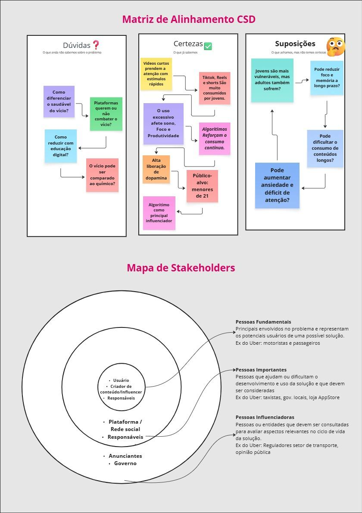
> * **Mapa de stakeholders**: 
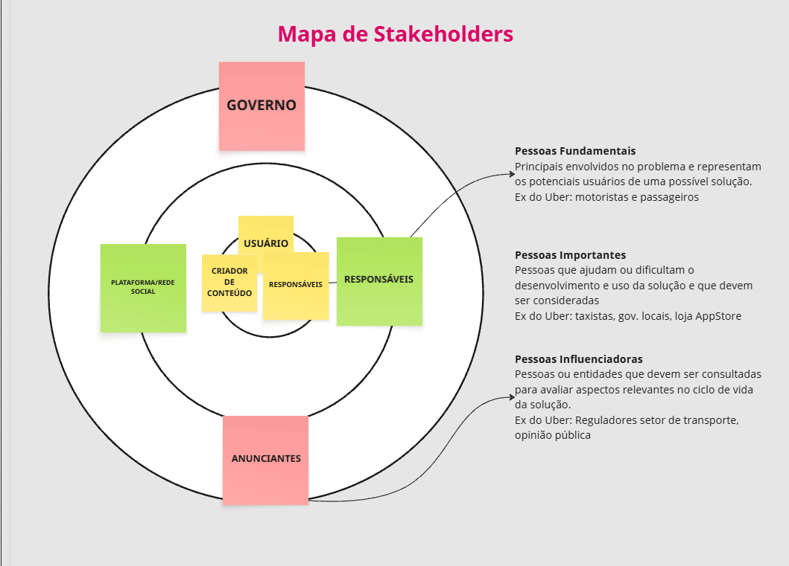
> * **Entrevistas qualitativas**: 
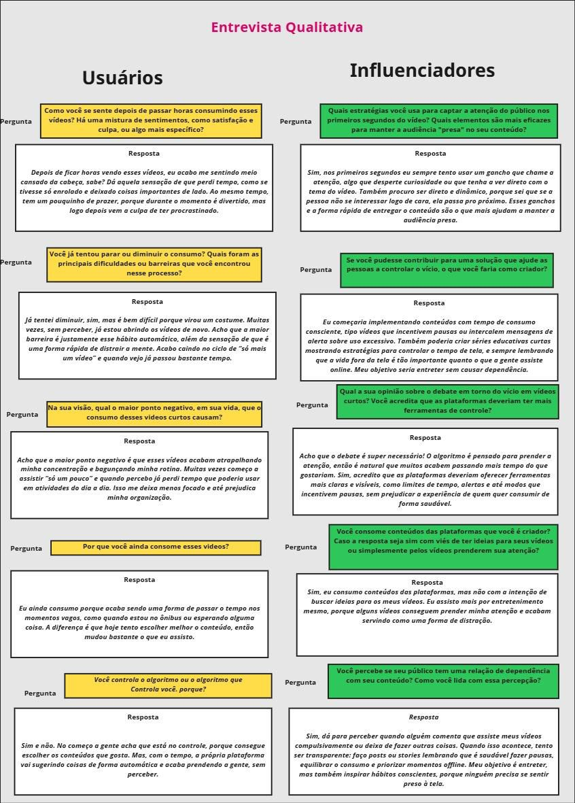
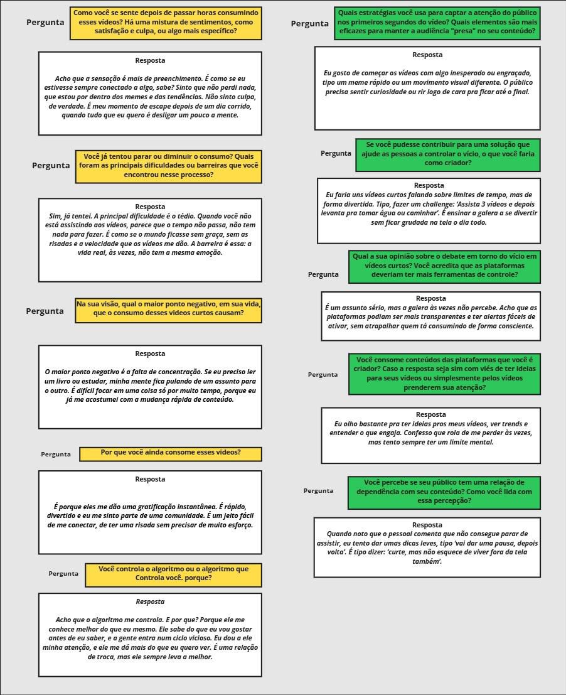
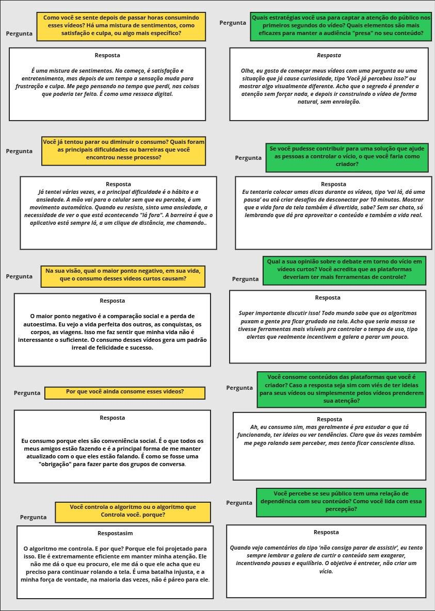
> * **Highlights de pesquisa**: 
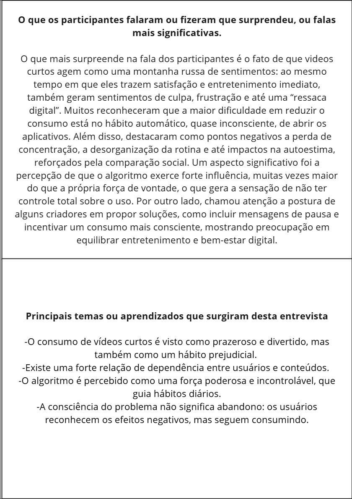
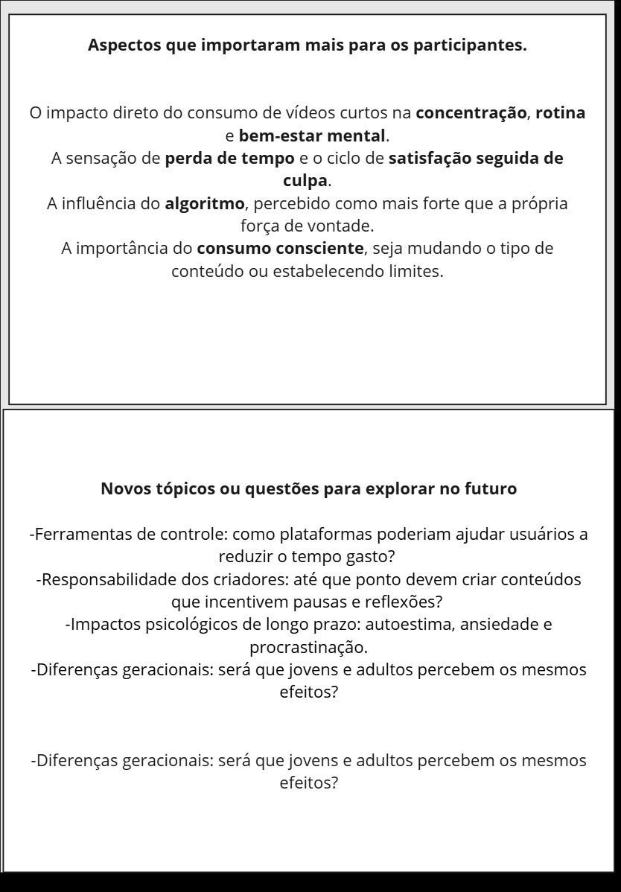

## Etapa de Definição

### Personas

**✳️✳️✳️ APRESENTE OS DIAGRAMAS DE PERSONAS ✳️✳️✳️**

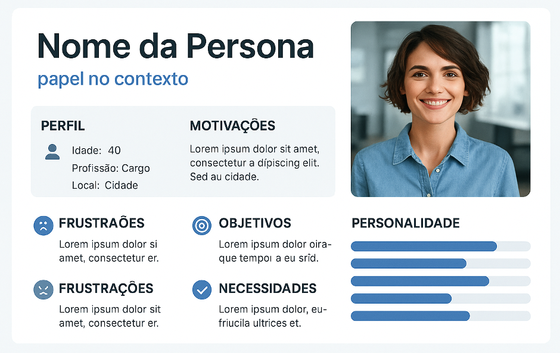

> ⚠️ **APAGUE ESSA PARTE ANTES DE ENTREGAR SEU TRABALHO**
>
> Relacione as personas identificadas no seu projeto e os respectivos mapas de empatia. Lembre-se que você deve ser enumerar e descrever precisamente e de forma personalizada todos os principais envolvidos com a solução almeja.
>
> **Orientações**:
>
> - [Persona x Público-alvo](https://flammo.com.br/blog/persona-e-publico-alvo-qual-a-diferenca/)
> - [O que é persona?](https://resultadosdigitais.com.br/blog/persona-o-que-e/)
> - [Rock Content](https://rockcontent.com/blog/personas/)
> - [Criar personas (Hotmart)](https://blog.hotmart.com/pt-br/como-criar-persona-negocio/)

# Product Design

Nesse momento, vamos transformar os insights e validações obtidos em soluções tangíveis e utilizáveis. Essa fase envolve a definição de uma proposta de valor, detalhando a prioridade de cada ideia e a consequente criação de wireframes, mockups e protótipos de alta fidelidade, que detalham a interface e a experiência do usuário.

## Histórias de Usuários

Com base na análise das personas foram identificadas as seguintes histórias de usuários:

| EU COMO...`PERSONA` | QUERO/PRECISO ...`FUNCIONALIDADE`        | PARA ...`MOTIVO/VALOR`               |
| --------------------- | ------------------------------------------ | -------------------------------------- |
| Usuário    | Um temporizador que me desconecte por um período de tempo. | Para me ajudar a controlar o tempo e evitar o vício, criando hábitos mais saudáveis.             |
| Usuário        |  Um painel de controle onde posso ver estatísticas do meu uso de redes sociais e ajustar meu comportamento.      | Entender melhor meus hábitos e tomar decisões mais conscientes sobre o uso das plataformas. |
| Usuário    | Registrar diariamente meu tempo de uso e ver minha evolução. | Controlar o tempo e evitar o vício, me permitindo focar em outras atividades, como hobbies e estudos.             |
| Usuário    | Um temporizador que me desconecte por um período de tempo. | Para me ajudar a controlar o tempo e evitar o vício, criando hábitos mais saudáveis.             |
| Usuário    | Ter relatórios semanais sobre o tempo gasto em vídeos curtos e dicas personalizadas de redução. | mMelhorar minha produtividade e recuperar tempo para atividades pessoais e familiares.             |
| Usuário    | Receber alertas de tempo e bloqueios temporários após muito uso contínuo. | Evitar perder horas em vídeos curtos e ter mais foco nos estudos e na vida social real.
            |
| Usuário    | Ter desafios gamificados que incentivem a reduzir o tempo em vídeos curtos. | Aprender a usar melhor meu tempo livre e desenvolver hábitos mais saudáveis de lazer.             |


## Proposta de Valor

**✳️✳️✳️ APRESENTE O DIAGRAMA DA PROPOSTA DE VALOR PARA CADA PERSONA ✳️✳️✳️**

##### Proposta de valor para Persona XPTO ⚠️ EXEMPLO ⚠️


> ⚠️ **APAGUE ESSA PARTE ANTES DE ENTREGAR SEU TRABALHO**
>
> O mapa da proposta de valor é uma ferramenta que nos ajuda a definir qual tipo de produto ou serviço melhor atende às personas definidas anteriormente.

## Requisitos

As tabelas que se seguem apresentam os requisitos funcionais e não funcionais que detalham o escopo do projeto.

### Requisitos Funcionais

| ID     | Descrição do Requisito                                   | Prioridade |
| ------ | ---------------------------------------------------------- | ---------- |
| RF-001 | O sistema deve permitir ao usuário preencher um Mapa de Emoções, e a partir das respostas, gerar sugestões personalizadas de atividades offline. | ALTA       |
| RF-002 | O sistema deve disponibilizar um quiz interativo de hábitos digitais e, ao final, mostrar um perfil ou dicas de melhoria. | ALTA    |
| RF-003 | O sistema deve permitir que o usuário inicie um temporizador de desconexão (ex.: 15, 30, 60 minutos) e exibir uma mensagem motivacional ao término. | ALTA       |
| RF-004 | O sistema deve permitir o registro diário do tempo de uso de redes sociais e apresentar um gráfico de evolução (linha ou barras). | MÉDIA     |
| RF-005 | O sistema deve gerar, mediante clique em botão, atividades offline aleatórias (ex.: “caminhe 10 minutos”, “leia 5 páginas de um livro”) | MÉDIA      |
| RF-006 | O sistema deve oferecer um mural de conquistas, atribuindo badges, mensagens de parabéns ou troféus  quando metas de desconexão forem alcançadas | MÉDIA     |
| RF-007 | O sistema deve permitir ao usuário criar e marcar um checklist diário de tarefas ou metas offline | BAIXA     |
| RF-008 | O sistema deve possibilitar ao usuário compartilhar seus resultados, como tempo offline ou conquistas, gerando uma imagem ou link | BAIXA     |
| RF-009 | O sistema deve exibir uma tela de “modo foco” que cobre a página e só libera o acesso a certas seções depois de um tempo determinado. | BAIXA      |
| RF-010 | O sistema deve permitir que o usuário escreva uma frase curta sobre como se sentiu ao passar menos tempo nas redes, salvando no próprio navegador (localStorage) | BAIXA     |


### Requisitos não Funcionais

| ID      | Descrição do Requisito                                                              | Prioridade |
| ------- | ------------------------------------------------------------------------------------- | ---------- |
| RNF-001 | O site deve ser responsivo, permitindo navegação e uso adequado em celulares, tablets e desktops.| ALTA     |
| RNF-002 | O site deve estar disponível 24 horas por dia, todos os dias, hospedado em ambiente público.          | ALTA      |
| RNF-001 | Desenvolvimento em HTML, CSS e JavaScript. | ALTA     |
| RNF-002 | Páginas devem ser carregadas em 5 segundos         | MÉDIA      |

## Projeto de Interface

Artefatos relacionados com a interface e a interacão do usuário na proposta de solução.

### Wireframes

Estes são os protótipos de telas do sistema.

**✳️✳️✳️ COLOQUE AQUI OS PROTÓTIPOS DE TELAS COM TÍTULO E DESCRIÇÃO ✳️✳️✳️**

##### TELA XPTO ⚠️ EXEMPLO ⚠️

Descrição para a tela XPTO

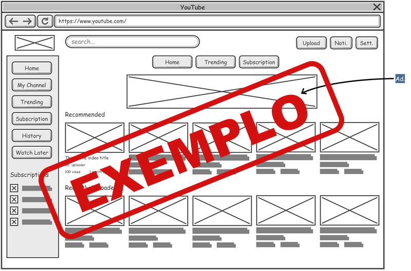

> ⚠️ **APAGUE ESSA PARTE ANTES DE ENTREGAR SEU TRABALHO**
>
> Wireframes são protótipos das telas da aplicação usados em design de interface para sugerir a estrutura de um site web e seu relacionamentos entre suas páginas. Um wireframe web é uma ilustração semelhante ao layout de elementos fundamentais na interface.
>
> **Orientações**:
>
> - [Ferramentas de Wireframes](https://rockcontent.com/blog/wireframes/)
> - [Figma](https://www.figma.com/)
> - [Adobe XD](https://www.adobe.com/br/products/xd.html#scroll)
> - [MarvelApp](https://marvelapp.com/developers/documentation/tutorials/)

### User Flow
## TELA DE CADASTRO
Página para o usuário se cadastrar
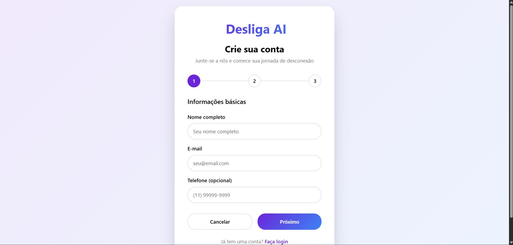

## TELA DE LOGIN
Página para o usuário ja cadastrado realizar seu login
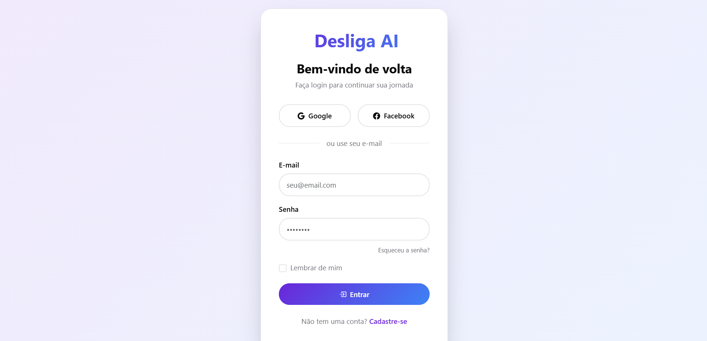

## HOMEPAGE
Tela inicial do sistema
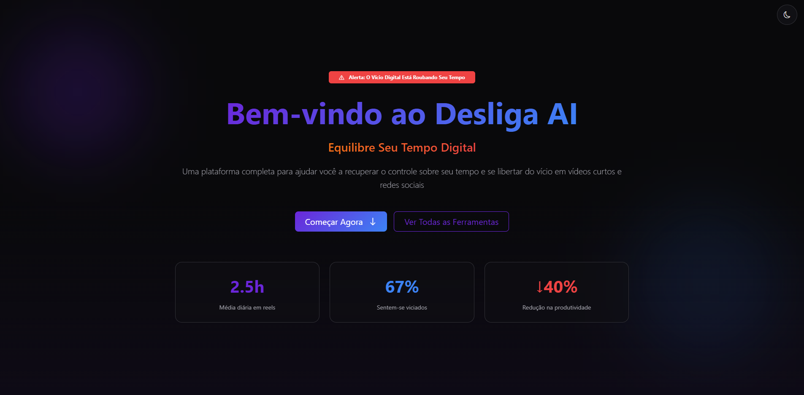
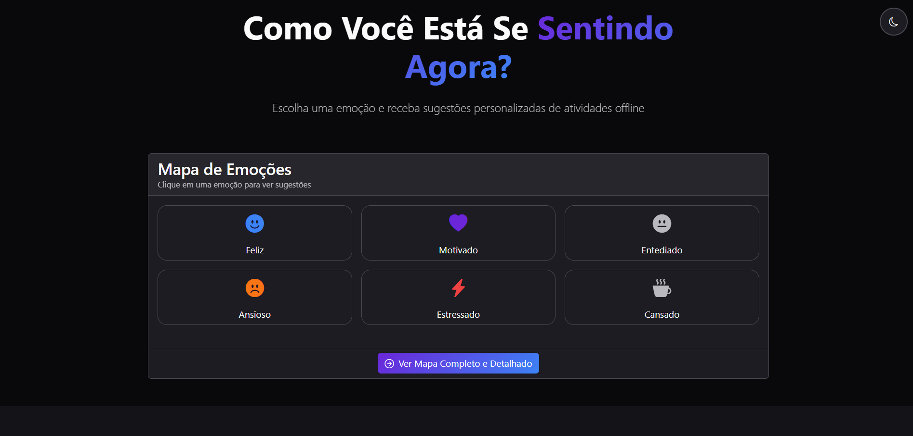
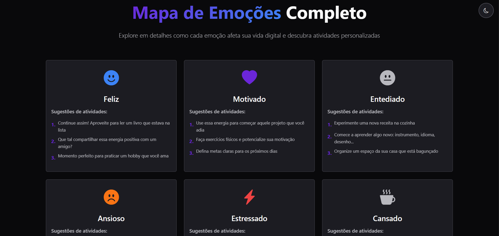
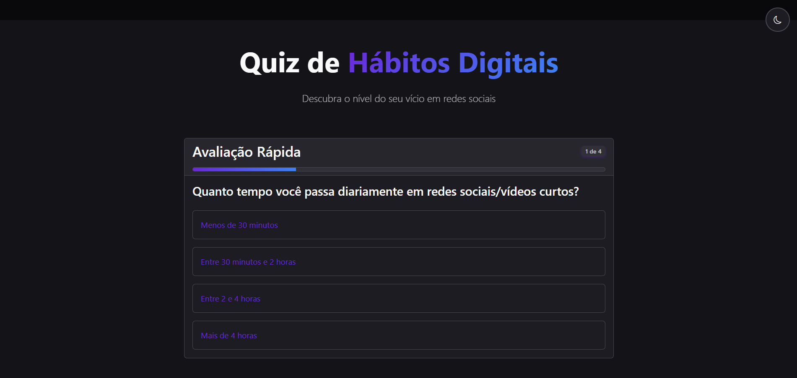
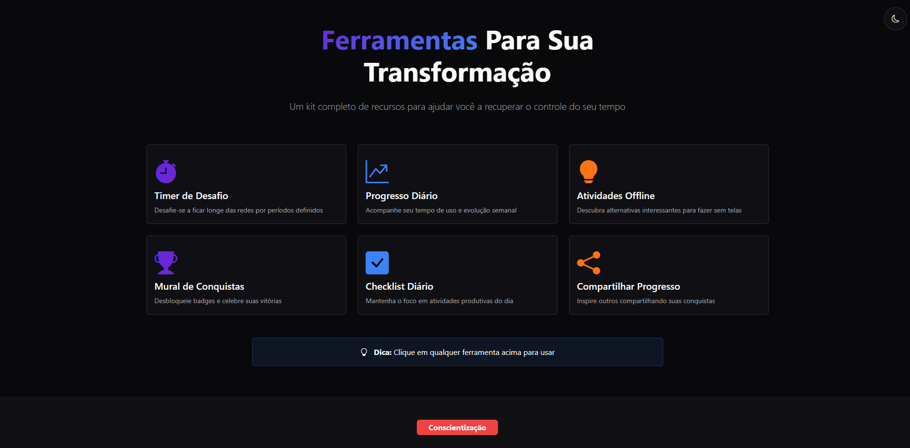
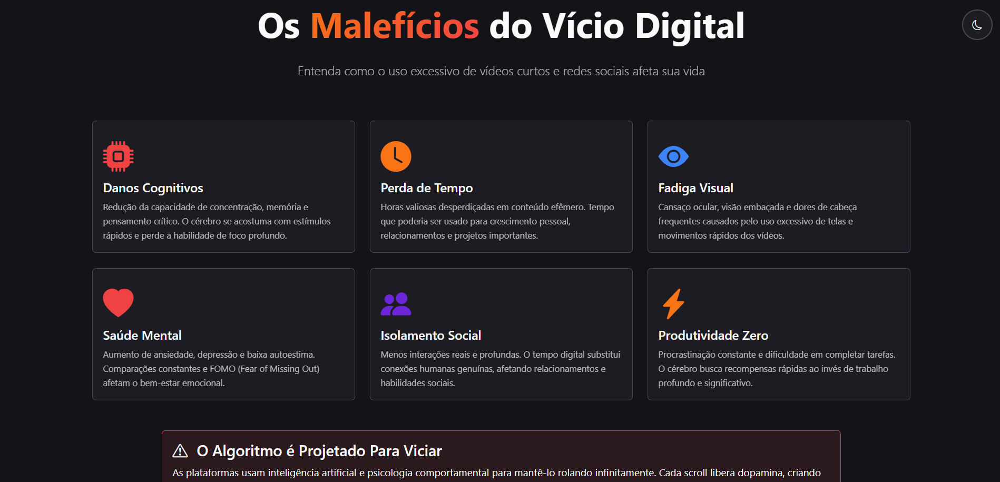
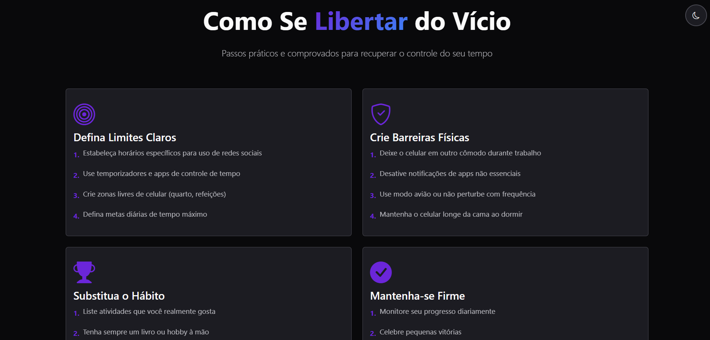

## FERRAMENTAS PARA TRANSFORMAÇÃO
Ferramentas que o usuário tem a disposição


# TIMER DE FOCO
Usuário estipula um tempo para se concentrar em alguma atividade


# ATIVIDADES OFFLINE
Gera aleatoriamente atividades para o usuário realizar fora de aparelhos eletrônicos
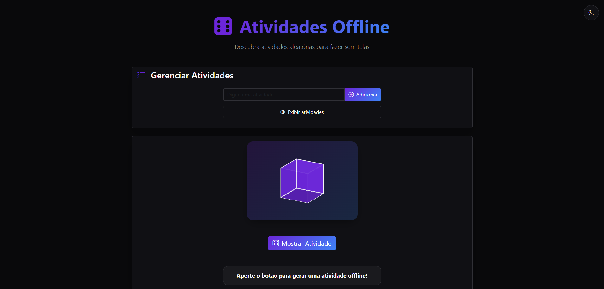

# MURAL DE CONQUISTAS
Usuário desbloqueia conquistas conforme progride em seus hábitos mais saudáveis
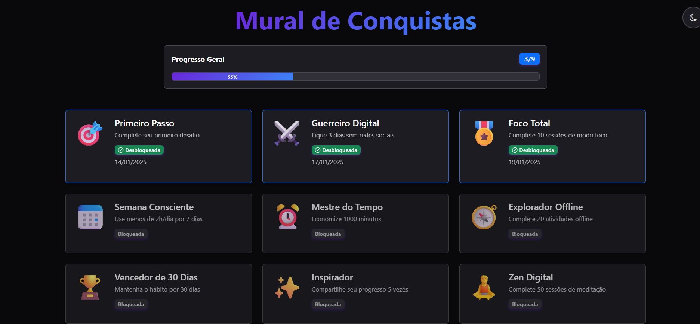

# CHECKLIST DIARIO
Usuário registra seu progesso (atividades realizadas, tempo offline)
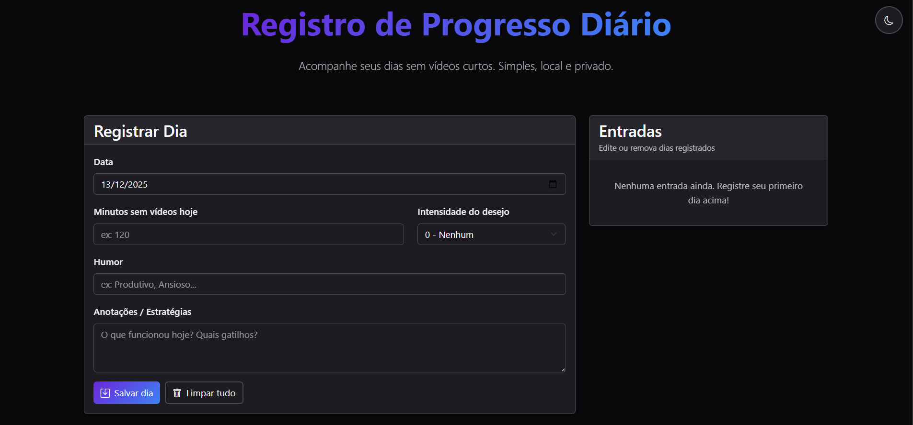
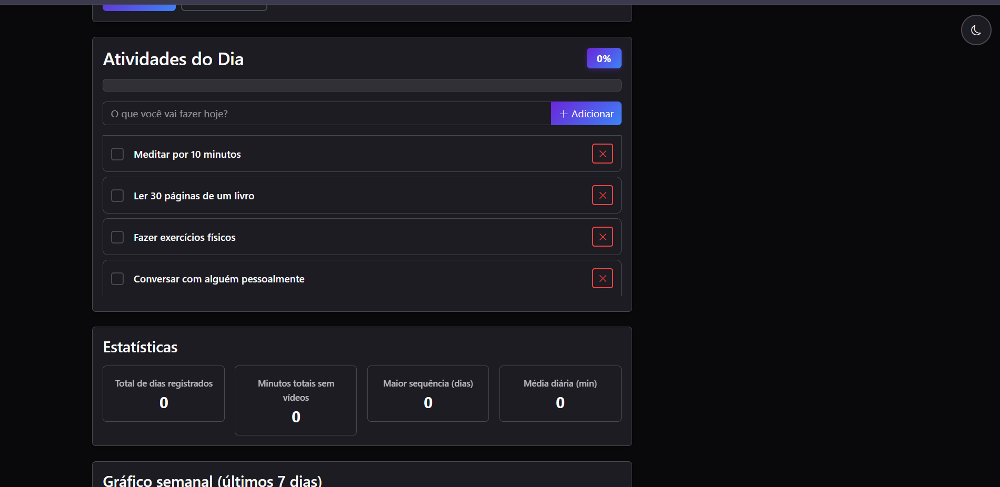

# COMPARTILHAR PROGESSO
Permite ao usuário compartilhar suas conquistas
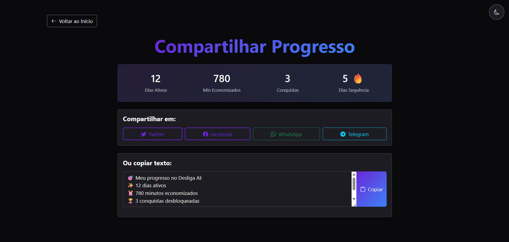

### Protótipo Interativo

**Protótipo**

✅ [Protótipo Interativo (FIGMA)](https://www.figma.com/proto/BesodWhSexmTbVNpXQZYTE/A-equipe-de-PROEZA-BR-team-library?node-id=3342-493&p=f&t=gnrTA6HItXwBwr0M-0&scaling=min-zoom&content-scaling=fixed&page-id=0%3A1&starting-point-node-id=3321%3A2)

# Metodologia

SCRUM

## Ferramentas

Relação de ferramentas empregadas pelo grupo durante o projeto.

| Ambiente                    | Plataforma | Link de acesso                                     |
| --------------------------- | ---------- | -------------------------------------------------- |
| Processo de Design Thinking | Miro       | https://miro.com/app/board/uXjVJSvRFrU=/        |
| Repositório de código     | GitHub     | https://github.com/ICEI-PUC-Minas-PMGES-TI/pmg-es-2025-2-ti1-2401100-desligaai.git  |
| Fluxo de telas         |Figma     | https://www.figma.com/design/ouGlfzGAOWuYidIOh3YWfh/Fluxo-de-telas?node-id=0-1&p=f&t=wzfVVVVg6ufe6a3N-0 |
| Hospedagem do site          | Render     | https://site.render.com/XXXXXXX ⚠️ EXEMPLO ⚠️ |
| Editor de código         | VsCode     | https://code.visualstudio.com/ |
| Apresentação       | Canva     | https://www.canva.com/ |
| Reuniões       | Discord     | https://discord.com/ | 
| Protótipo Interativo       | Figma  | https://www.figma.com/proto/BesodWhSexmTbVNpXQZYTE/A-equipe-de-PROEZA-BR-team-library?node-id=3342-493&p=f&t=gnrTA6HItXwBwr0M-0&scaling=min-zoom&content-scaling=fixed&page-id=0%3A1&starting-point-node-id=3321%3A2   |
|                             |            |                                                    |

# Solução Implementada

Esta seção apresenta todos os detalhes da solução criada no projeto.

## Vídeo do Projeto

O vídeo a seguir traz uma apresentação do problema que a equipe está tratando e a proposta de solução.

[](https://www.youtube.com/embed/70gGoFyGeqQ)

## Funcionalidades

Esta seção apresenta as funcionalidades da solução.Info

##### Funcionalidade 1 - Cadastro de Usuário

Permite a criação de um perfil para o usuário

* **Estrutura de dados:** [Contatos](#ti_ed_contatos)
* **Instruções de acesso:**
  * Abra o site e clique em cadastrar
* **Tela da funcionalidade**:


##### Funcionalidade 2 - Login de usuário

Permite que o usuário logue em sua conta

* **Instruções de acesso:**
  * Ao abrir o site clique para Fazer Login
* **Tela da funcionalidade**:


##### Funcionalidade 3 - Timer de Desafio
Permite que o usuário registre o tempo que ele deseja se desconectar e focar em alguma atividade
* **Instruções de acesso:**
  * Com login realizado
  * Clique em Timer de desafio
  * Selecione o tempo que deseja se concentrar
  * Selecione o tempo que deseja de descanso
  * Selecione a quantidade de ciclos desejada
  * Clique em iniciar
* **Tela da funcionalidade**:


##### Funcionalidade 4 - Atividades Offline
Gera atividades de forma aleatória para o usuário realizar longe de telas.

* **Instruções de acesso:**
  * Com login realizado
  * Clique em Atividades Offline
  * Clique em mostrar atividade
  * Automaticamente uma atividade é apresentada
  * O usuário tem permissão de editar a atividade, excluir ou adicionar alguma outra
* **Tela da funcionalidade**:


##### Funcionalidade 5 - Checklist Diário
Usuário registra quais atividades ele realizou no dia, seu tempo de desconexão e conexão

* **Instruções de acesso:**
  * Com login realizado
  * Clique em Checklist Diário
  * Registre a data
  * Registre o tempo que ficou sem vídeos
  * Registre qual o seu desejo ao ver os vídeos
  * Tome alguma nota pessoal
  * Clique em Salvar dia
* **Tela da funcionalidade**:


##### Funcionalidade 6 - Checklist Diário > Atividades do dia

Registre quais atividades foram realizadas naquele dia

* **Instruções de acesso:**
  * Após seguir os passos da Funcionalidade 5:
  * Role a tela
  * Adicione as atividades que realizou naquele dia e marque a caixinha
  * O usuário pode criar suas atividades durante o dia, e a noite registrar quais foram cumpridas
* **Tela da funcionalidade**:


##### Funcionalidade 7 - Compartilhar Progresso

Usuário pode compartilhar seu progresso

* **Instruções de acesso:**
  * Com login realizado
  * Clique em Compartilhar Progresso
  * Escolha a rede em que deseja compartilhar

* **Tela da funcionalidade**:


##### Funcionalidade 8 - Mapa de Emoções

Usuário coloca uma emoção e atividades são sugeridas

* **Instruções de acesso:**
  * Com login realizado
  * Na home-page
  * Selecione uma emoção

* **Tela da funcionalidade**:


##### Funcionalidade 9 - Quiz de hábitos

Usuário responde a um quiz sobre seus hábitos digitais

* **Instruções de acesso:**
  * Com login realizado
  * Na home-page
  * Responda ás perguntas do quiz honestamente

* **Tela da funcionalidade**:


## Estruturas de Dados

Descrição das estruturas de dados utilizadas na solução com exemplos no formato JSON.Info

##### Estrutura de Dados - Contatos   ⚠️ EXEMPLO ⚠️

Contatos da aplicação

```json
  {
    "id": 1,
    "nome": "Leanne Graham",
    "cidade": "Belo Horizonte",
    "categoria": "amigos",
    "email": "Sincere@april.biz",
    "telefone": "1-770-736-8031",
    "website": "hildegard.org"
  }
  
```

##### Estrutura de Dados - Usuários  ⚠️ EXEMPLO ⚠️

Registro dos usuários do sistema utilizados para login e para o perfil do sistema

```json
  {
    id: "eed55b91-45be-4f2c-81bc-7686135503f9",
    email: "admin@abc.com",
    id: "eed55b91-45be-4f2c-81bc-7686135503f9",
    login: "admin",
    nome: "Administrador do Sistema",
    senha: "123"
  }
```

> ⚠️ **APAGUE ESSA PARTE ANTES DE ENTREGAR SEU TRABALHO**
>
> Apresente as estruturas de dados utilizadas na solução tanto para dados utilizados na essência da aplicação quanto outras estruturas que foram criadas para algum tipo de configuração
>
> Nomeie a estrutura, coloque uma descrição sucinta e apresente um exemplo em formato JSON.
>
> **Orientações:**
>
> * [JSON Introduction](https://www.w3schools.com/js/js_json_intro.asp)
> * [Trabalhando com JSON - Aprendendo desenvolvimento web | MDN](https://developer.mozilla.org/pt-BR/docs/Learn/JavaScript/Objects/JSON)

## Módulos e APIs

Esta seção apresenta os módulos e APIs utilizados na solução

**Images**:

* Unsplash - [https://unsplash.com/](https://unsplash.com/) ⚠️ EXEMPLO ⚠️

**Fonts:**

* Icons Font Face - [https://fontawesome.com/](https://fontawesome.com/) ⚠️ EXEMPLO ⚠️

**Scripts:**

* jQuery - [http://www.jquery.com/](http://www.jquery.com/) ⚠️ EXEMPLO ⚠️
* Bootstrap 4 - [http://getbootstrap.com/](http://getbootstrap.com/) ⚠️ EXEMPLO ⚠️

> ⚠️ **APAGUE ESSA PARTE ANTES DE ENTREGAR SEU TRABALHO**
>
> Apresente os módulos e APIs utilizados no desenvolvimento da solução. Inclua itens como: (1) Frameworks, bibliotecas, módulos, etc. utilizados no desenvolvimento da solução; (2) APIs utilizadas para acesso a dados, serviços, etc.

# Referências

As referências utilizadas no trabalho foram:

* SOBRENOME, Nome do autor. Título da obra. 8. ed. Cidade: Editora, 2000. 287 p ⚠️ EXEMPLO ⚠️

> ⚠️ **APAGUE ESSA PARTE ANTES DE ENTREGAR SEU TRABALHO**
>
> Inclua todas as referências (livros, artigos, sites, etc) utilizados no desenvolvimento do trabalho.
>
> **Orientações**:
>
> - [Formato ABNT](https://www.normastecnicas.com/abnt/trabalhos-academicos/referencias/)
> - [Referências Bibliográficas da ABNT](https://comunidade.rockcontent.com/referencia-bibliografica-abnt/)
